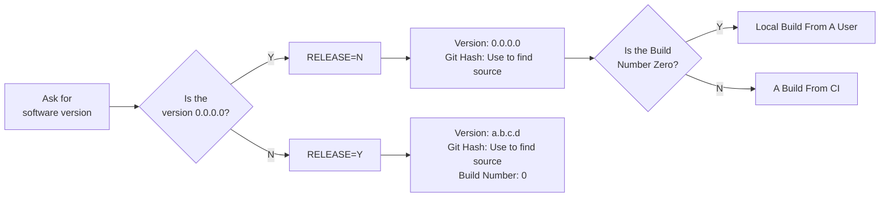

# The V1 Makefile System

---

# A Quick History

- Each repo had a copy paste makefile for their project
- The launch of skynet.v1 in 2016 brought a new requirement that all projects needs to use the tools in the same way
- Supplier compilers were used everywhere

- Each compiler got a custom makefile
  - Common functions went into makecommon
  - targetcommon (inside makecommon) handled all the basic tasks of finding sources and making APLs from parametric data.

---

# Benefits
- Users define a top level makefile and non-recursively include common makefiles shared via submodules
- Common Code Support
- Very similar interface between compilers
- CI support by default
- Reproducible builds regardless of OS
- `version.lua` files

# Cons

- One size fits all, hard to compile in code of bad quality from suppliers
- Not able to pass different flags to different files
- Custom Makefiles for each compiler meant a long bring up time

... But there was no other choice at the time

---

# Determining Software on a Unit

- Problem: Lots of software versions are built with the same version
- V1 built in a RELEASE=Y/N required flag
  - Git Hash is always provided to the program
  - RELEASE=Y
    - Sets the version to what is inside the `version.lua` file
    - Build Number set to 0
  - RELEASE=N
    - Version Set To 0
    - Build Number
      - Local User: Set to 0
      - CI System: Set to build number

---

# Determining Software on a Unit

- Approaching a unit and figuring out exactly what software was put on it has always been a challenge



- Ways to get versions:
  - Application Version: ERD 0x0031 or the GEA 0x01 message
  - Git Hash: ERD 0x007F
  - Build Number: ERD 0x0031

---

# Determining Software on a Unit

- People tend to build their boot loaders through the applications with RELEASE=Y
- No ERDs available for Git Hash and Build Number in the boot loader
- Image CRC is one of the only good ways to trace boot loader sources to code

---


# Installing Tools

- Common code does not like having users have to follow a long instruction list to install everything needed to compile code
- Developed a two tool strategy
  - `appl` does the initial computer setup and installs tools like `homebrew`, which allows for other software to be quickly installed
  - The V1 Makefiles then install/clone the tools they need at runtime, making it so the user's builds just work

---

# Issues With Changing Build Flags

- Changing `RELEASE=N` to `RELEASE=Y` required the user to clean build manually
- Changing variables inside the makefile may cause an incorrect build

---
layout: section
---

# The V2 Makefile System

---

# The V2 Makefile System

- Fast forward a few years and GCC compilers are expected to be used
- Since all the compilers work the same way, the downsides of V1 were starting to get annoying
- A common [gcc-builder](https://github.com/geappliances/build-tools.gcc-builder) used for all the compilers
- Continues the recommended options but also give users the ability to change flags and isolate code in libraries
- Makes the makefile dependent on:
  - The Makefile themselves
  - Flags passed into the makefiles

---

# gcc-builder
- [Capturing flags](https://github.com/geappliances/build-tools.gcc-builder/blob/master/worker.mk#L197)
- [Generating Rules for source](https://github.com/geappliances/build-tools.gcc-builder/blob/master/worker.mk#L198)
- [Generating Libs Rules](https://github.com/geappliances/build-tools.gcc-builder/blob/master/worker.mk#L209C38-L209C50)
- [Creating the Output](https://github.com/geappliances/build-tools.gcc-builder/blob/master/worker.mk#L219)
- [Creating a SREC](https://github.com/geappliances/build-tools.gcc-builder/blob/master/worker.mk#L225)
- [Including Dependency Files](https://github.com/geappliances/build-tools.gcc-builder/blob/master/worker.mk#L256)

---

# V2 Structure

- Users submodule a specific compiler tools repo
  - llvm-rl78/kpit-rl78
  - kpit-rx
  - sdcc-stm8
  - gcc-arm-none-eabi
  - gcc (building for the PC)

- Each repo includes the correct tools and extra utilities needed for that micro family

---

# V2 Structure

- Users then create their own frontend makefile and include the following makefiles:
  - `setup.mk`: Included first in the file
    - Includes non-recipe dependencies
      - Variables
      - Functions
      - makecommon
  - `defaults.mk`: Included after the `setup.mk` but before any libraries or source setup
    - The optional defaults for this compiler
  - `worker.mk`: Must be the last file in the frontend makefile
    - Includes all the recipes that build the code from `.c` and `.apl` to `.apl`

---

# V2 Makefile Variables

- `TARGET`: The name of the program
- `OUTPUT_DIR`: The folder were all built items will go. Almost always set to `build`. If a project has multiple builds, set to `build/$(TARGET)`
- `DEFINES`: A GEA specific variable that adds `-D` to the front of any define added to the list.
  - `DEFINES+=TEST=5 FOO=BAR`

---

# V2 Makefile Variables

- `SRC_FILES`: A list of files to compile.
- `SRC_DIRS`: Searches each folder for sources. Sources are files with an extension that matches the [SRC_EXTENSIONS](https://github.com/geappliances/build-tools.gcc-builder/blob/master/worker.mk#L18C34-L18C34) list.
- `INC_DIRS`: Folders that should be included to compile. `SRC_DIRS` is automatically added to the list.
- `LDLIBS`: Libraries to link in at the final step
- `CFLAGS`: Flags to pass to `gcc`
- `CPPFLAGS`: Flags to pass to the preprocessor
- `CXXFLAGS`: Flags to pass to `g++`
- `LDFLAGS`: Flags to pass to the linker

---

# V2 Makefile Targets

Inside the [gcc-builder](https://github.com/geappliances/build-tools.gcc-builder/blob/master/worker.mk#L12) is:
```makefile
LINK_OUTPUT?=$(TARGET).elf
...
$(OUTPUT_DIR)/$(LINK_OUTPUT): ... lots of deps
```

However in [build-tools.gcc-release/worker.mk](https://github.com/geappliances/build-tools.gcc-release/blob/master/worker.mk#L12) this is overwritten to `LINK_OUTPUT?=$(TARGET)` since programs to run on a computer do not not typically include the `.elf` extension.

Any top level makefile using `build-tools.gcc-release` should then have a default rule such as:

```makefile
.PHONY: all
all: $(OUTPUT_DIR)/$(TARGET)
	@echo Build Complete
```

When working with embedded projects, we target `.apl` files, which will be discussed in Startup Code.

---

# Libraries

- Are used to isolate code and allow for different compiling options
  - Isolate vender code (suppressing warnings)
  - Make it easier for others to include a block of code

- Libraries use the same variables as before but the are prefixed with the library name
  - `<lib-name>_SRC_FILES`, `<lib-name>_SRC_DIRS`, `<lib-name>_INC_FILES`, `<lib-name>_DEFINES`, etc
- The library is defined in a separate makefile to allow many different makefiles to include them
  - `lib_<library-name>.mk` is the naming standard

---

# Libraries

- Libraries are typically made using the helper function [create_library_with_defaults](https://github.com/geappliances/applcommon.makecommon/blob/9bee62d1ba7305eacda583f7d01f3816557c2697/v2/targetcommon/builder/setup.mk#L18)
  - This auto imports all the existing flags to the current library
- `makecommon` includes a function `$(call current_path)`, and that should be used so others can include the library from different directories
  - `$(call create_library_with_defaults,applcommon,$(call current_path)/src)`
- Example: [lib_lvgl.mk](https://github.com/geappliances/applcommon.lvgl-8-3/blob/master/lib_lvgl.mk)

- The lab is going to require you to make a library without the helper function or to overwrite the `DEFINES` variable for the library

---

# RX130 Example

- [Top Level Makefile](https://github.com/geappliances/applcommon.embedded-starter-kit/blob/master/rx130.mk)

- [Included Applcommon Library](https://github.com/geappliances/applcommon.applcommon/blob/master/lib_applcommon.mk)

- [Kpit RX Tools](https://github.com/geappliances/build-tools.kpit-rx)
