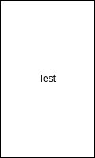

<style>
img[alt~="center"] {
  display: block;
  margin: 0 auto;
}
</style>

# Slide 1
<div class="columns">
<div class="columns-left">

- `a` is defined as a variable that can be changed.
- `a` is set equal to 1
- `a`'s valus is then increased by one

</div>
<div class="columns-right">

```
let a = 1;
a++;
```


</div>
</div>

---

# Slide 2

foobar
