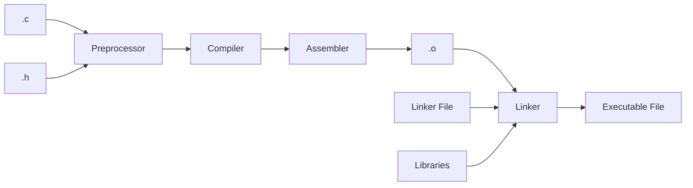

# SQL
Dan Nassirharand

---

# Overview

- Relational Algebra (RA)
  - Relations
  - Operations
- Database Management System (DBMS)
- SQL
- Practicum

<!--
- High level
  - I assume you know nothing
  - Good refresher/overview of the basics
  - See resources for more in-depth info

We will be working with relational databases
  I will provide resources for you to explore this vast topic

I will go through the conceptual parts and pieces first then apply what we learned with real life examples
-->

<!-- TODO  maybe add a note about the difference beween theory and application (i.e. relation vs table) -->

---

# Database

<v-click>
  "A database is an organized collection of structured information, or data, typically stored electronically in a computer system." - <a href="https://www.oracle.com/database/what-is-database/" target="_blank">Oracle</a>
</v-click>
<br><br><br>
<v-clicks depth=2>

- Tables (a.k.a. Relations)
  - Relational Schema
  - Attribute
  - Record

</v-clicks>

<!--

- Database: [click]A thing with stuff in it

-->

---

# Relational Schema

<div>
  "A database schema defines how data is organized within a relational database" - <a href="https://www.ibm.com/think/topics/database-schema" target="_blank">IBM</a>
</div>

- Acts as the blueprint for your databse
  - What does it look like?
  - What type of data is stored?


---

# Attribute

- Attributes are properties or characteristics of an entity
- Attributes are used to describe the entity.

\- <a href="https://www.geeksforgeeks.org/dbms/attributes-in-dbms/" target="_blank">GFG</a>


---

# Record

- An entity that exists within the relation


---

# Relational Algebra
https://www.geeksforgeeks.org/dbms/introduction-of-relational-algebra-in-dbms/

The main purpose of relational algebra is to define operators that transform one or more input relations to an output relation. - <a href="https://en.wikipedia.org/wiki/Relational_algebra" target="_blank">Wikipedia</a>

## Operations
- Selection (σ)
- Projection (π)
- Union (U)
- Set Difference (-)
- More ...

---

# Database Management System (DBMS)


---

# SQL

---

# Practicum

---
layout: two-cols
---

# Slots

- Slots allow for you to interact with a layout
- `::name::` before the content how you direct content into particular areas of the layout
- This example is using the `two-cols` layout and `::right::` is used to place foo in the right column

```markdown

... The text above

::right::

foo
```

::right::

foo

---

# Custom Layouts

- Did you notice how `foo` was level with the title slots of the last slide?
- We've made our own custom layouts you can use, or you can make your own. Find them [here](https://github.com/geappliances/applcommon.slidev-layouts).
  - Making a folder `layouts` at the root of the folder and submoduling it in that folder will make the layouts available


```markdown
---
layout: applcommon-two-cols-header
---

# Example

- Header info that spans both columns, optional

::left::

Hello

::right::

Same level as hello!
```

---
layout: applcommon-two-cols-header
---

# Example

- Header info that spans both columns, optional

::left::

Hello

::right::

Same level as hello!

---
layout: applcommon-two-cols-header
---

# Some Content From A Course!
- Each recipe is printed on the command line when executed
- Great for debugging, bad for normal use
- Using `@` at the start of a line will suppress the echoing and only print the standard output or standard error of the commands


::left::
```makefile
.PHONY: all
all:
	echo hello
```

```makefile
.PHONY: all
all:
	@echo hello
```

::right::
```bash
$ make
echo hello
hello
```

```bash
$ make
hello
```

---
src: ./a-different-file.md
---

---

# Presenter notes

```markdown
---
layout: cover
---

# Page 1

This is the cover page.

<!-- This is a note -->

---

# Page 2

<!-- This is NOT a note because it precedes the content of the slide -->

The second page

<!--
This is another note
-->
```

---
layout: applcommon-two-cols-header
---

# Line Highlighting

- Described [here](https://sli.dev/guide/syntax#line-highlighting)
- Put line numbers within brackets `{}` to highlight them

::left::

````
```{2,3}
function add(
  a: Ref<number> | number,
  b: Ref<number> | number
) {
  return computed(() => unref(a) + unref(b))
}
```
````

::right::

```ts {2,3}
function add(
  a: Ref<number> | number,
  b: Ref<number> | number
) {
  return computed(() => unref(a) + unref(b))
}
```

---
layout: applcommon-two-cols-header
---

# Line Highlighting With Line Numbers

::left::

````
```{6,7}{lines:true,startLine:5}
function add(
  a: Ref<number> | number,
  b: Ref<number> | number
) {
  return computed(() => unref(a) + unref(b))
}
```
````

::right::
```ts {6,7}{lines:true,startLine:5}
function add(
  a: Ref<number> | number,
  b: Ref<number> | number
) {
  return computed(() => unref(a) + unref(b))
}
```

---
layout: applcommon-two-cols-header
---

# Line Highlighting Per Click

- Each click is separated by `|`

::left::

````
```{2-3|5|all}
function add(
  a: Ref<number> | number,
  b: Ref<number> | number
) {
  return computed(() => unref(a) + unref(b))
}
```
````

::right::

```ts {2-3|5|all}
function add(
  a: Ref<number> | number,
  b: Ref<number> | number
) {
  return computed(() => unref(a) + unref(b))
}
```

---
layout: applcommon-two-cols-header
---

# Images

- Images can be a bit tricky.
- Instead of using the default slidev imports, I've had a much easier time with HTML.

```html
" class="m-12 h-80" />
```

- `m`: is margin in pixels
- `h` is hight in pixels


::left::

```html

```


::right::

```html

```


---

# Making Images

- Use the [draw.io vscode extension](https://marketplace.visualstudio.com/items?itemName=hediet.vscode-drawio)
- Save the `.drawio` in the repo so others can modify the image in the future

- Make an image
- Export it
- Layers

---

# Supports Mermaid



