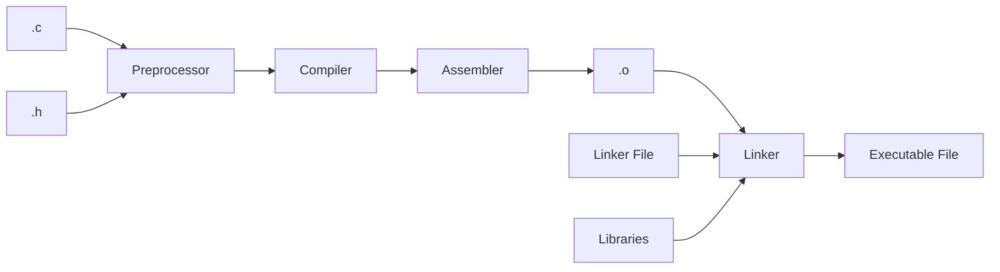

# Slidev
Chris Beeler

---

# Why?

- The slides are in plain text which allows for Git to render diffs
- Using Git and GitHub allow for easy collaboration
  - Storage in GitHub prevents important presentations from getting lost when employees leave
- Code renders nicely and has a copy button!

```js
console.log('This looks amazing');
```

```makefile
.PHONY: all
all:
	@echo Done!
```

- Amazing presentation tools
- Supports Dark Mode and Light Mode

---

# Presentation Tools

- When presenting, `slidev` hosts the slides via a web server and you can display through your browser
  - Others can connect and browse through the slides as they desire!
  - Connect now! VPN in and my IP is [ip:port](ip:port)
  - You can open the web server as many times as you wish, and put them on different slides
- The presenter connects to [ip:port/presenter](ip:port/presenter) to get slide notes
- A slide overview is available at [ip:port/overview](ip:port/overview).
- Draw tools are available

This is all printed out on the terminal when you run `npm run present`
---

# Outputs

- Can output a PDF via `npm run export` in this repo
- Can host slides via GitHub Pages
- [More info on exports](https://sli.dev/guide/exporting)

---

# Getting Started

- Make a slides.md in the root of the project:

````markdown
# Slidev

Hello World

---

# Page 2

Directly use code blocks for highlighting

```
console.log('Hello, World!')
```

---

# Page 3
````

Stolen from [sli.dev](https://sli.dev/guide/#markdown-syntax)

---

# Theme

- Themes are the style your slides use
- Navigate to the [Theme Gallery](https://sli.dev/themes/gallery) to select a theme
- You may need to do a `npm install` command if downloading a new theme not already available in the `package.json`
- To select a theme, use a formatter block at the top of the first slide:

```markdown
---
theme: seriph
---

# Title

Contents
```

---

# Layouts

- Layouts are how you make slides look differently, think of the intro slide.
- The layouts available to you depend on the theme you selected.
  - Navigate to the [Theme Gallery](https://sli.dev/themes/gallery) find your theme
  - Once selected, look at the Readme to see what layouts are available.
- Use formatter blocks to select a layout
- The default is this title and content layout you are looking at


```markdown
---
layout: intro
---

# The Intro Title
Cool text - Used in the first slide

---
layout: quote
---

This is a new slide
```

---
layout: statement
---

# This is a new slide

hello

---
layout: two-cols
---

# Slots

- Slots allow for you to interact with a layout
- `::name::` before the content how you direct content into particular areas of the layout
- This example is using the `two-cols` layout and `::right::` is used to place foo in the right column

```markdown

... The text above

::right::

foo
```

::right::

foo

---

# Custom Layouts

- Did you notice how `foo` was level with the title slots of the last slide?
- We've made our own custom layouts you can use, or you can make your own. Find them [here](https://github.com/geappliances/applcommon.slidev-layouts).
  - Making a folder `layouts` at the root of the folder and submoduling it in that folder will make the layouts available


```markdown
---
layout: applcommon-two-cols-header
---

# Example

- Header info that spans both columns, optional

::left::

Hello

::right::

Same level as hello!
```

---
layout: applcommon-two-cols-header
---

# Example

- Header info that spans both columns, optional

::left::

Hello

::right::

Same level as hello!

---
layout: applcommon-two-cols-header
---

# Some Content From A Course!
- Each recipe is printed on the command line when executed
- Great for debugging, bad for normal use
- Using `@` at the start of a line will suppress the echoing and only print the standard output or standard error of the commands


::left::
```makefile
.PHONY: all
all:
	echo hello
```

```makefile
.PHONY: all
all:
	@echo hello
```

::right::
```bash
$ make
echo hello
hello
```

```bash
$ make
hello
```

---
src: ./a-different-file.md
---

---

# Presenter notes

```markdown
---
layout: cover
---

# Page 1

This is the cover page.

<!-- This is a note -->

---

# Page 2

<!-- This is NOT a note because it precedes the content of the slide -->

The second page

<!--
This is another note
-->
```

---
layout: applcommon-two-cols-header
---

# Line Highlighting

- Described [here](https://sli.dev/guide/syntax#line-highlighting)
- Put line numbers within brackets `{}` to highlight them

::left::

````
```{2,3}
function add(
  a: Ref<number> | number,
  b: Ref<number> | number
) {
  return computed(() => unref(a) + unref(b))
}
```
````

::right::

```ts {2,3}
function add(
  a: Ref<number> | number,
  b: Ref<number> | number
) {
  return computed(() => unref(a) + unref(b))
}
```

---
layout: applcommon-two-cols-header
---

# Line Highlighting With Line Numbers

::left::

````
```{6,7}{lines:true,startLine:5}
function add(
  a: Ref<number> | number,
  b: Ref<number> | number
) {
  return computed(() => unref(a) + unref(b))
}
```
````

::right::
```ts {6,7}{lines:true,startLine:5}
function add(
  a: Ref<number> | number,
  b: Ref<number> | number
) {
  return computed(() => unref(a) + unref(b))
}
```

---
layout: applcommon-two-cols-header
---

# Line Highlighting Per Click

- Each click is separated by `|`

::left::

````
```{2-3|5|all}
function add(
  a: Ref<number> | number,
  b: Ref<number> | number
) {
  return computed(() => unref(a) + unref(b))
}
```
````

::right::

```ts {2-3|5|all}
function add(
  a: Ref<number> | number,
  b: Ref<number> | number
) {
  return computed(() => unref(a) + unref(b))
}
```

---
layout: applcommon-two-cols-header
---

# Images

- Images can be a bit tricky.
- Instead of using the default slidev imports, I've had a much easier time with HTML.

```html
" class="m-12 h-80" />
```

- `m`: is margin in pixels
- `h` is hight in pixels


::left::

```html

```


::right::

```html

```


---

# Making Images

- Use the [draw.io vscode extension](https://marketplace.visualstudio.com/items?itemName=hediet.vscode-drawio)
- Save the `.drawio` in the repo so others can modify the image in the future

- Make an image
- Export it
- Layers

---

# Supports Mermaid



