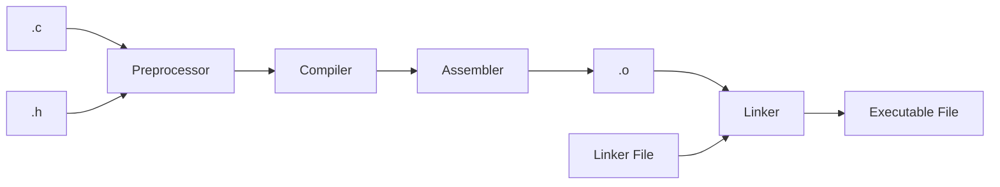

# What is a toolchain?

- A toolchain is a set of distinct software development tools that are linked (or chained) together by specific stages such as GCC, binutils and glibc (a portion of the GNU Toolchain) to produce binary code. [[1]](https://elinux.org/Toolchains)

- Toolchains often do multiple parts of compiling process unless requested otherwise.

- There are many types of toolchains, but GCC for C will be the main toolchain of discussion as it is the compiler of choice for the common code team when selecting new toolchains.

---

# Basic GCC flow



- This is is a very basic case and when compiling something as simple as a `Hello, World!` program, it gets even simpler.

- Additional steps are added based on the types of sources needed
  - LVGL takes `.jpg`/`.png`s and turns them into `.c` files, which can then be sent through the compiler

---

# Preprocessor

- Designed to make common C tasks easier.
- Is a `Lexical Preprocessor`, which only operates on the lexed, not parsed, input. It has no understanding of the language, just tokenization.

```c
#define NUMBER 5 + 1

int x = NUMBER * 2;

printf("%d\n", x); // What will this print?
```

<!-- 7 -->

---
layout: applcommon-two-cols-header
---

# Preprocessor
- A simple C program

::left::
```c
// main.c
#include "function.h"
#include "function.h"

int main(void)
{
  Function_Hello(Function_Defaults);

  return 0;
}
```

::right::
```c
// function.h
#ifndef FUNCTION_H
#define FUNCTION_H

enum {
  Function_Defaults = 5
};

void Function_Hello(int arg);

#endif
```

---

# Preprocessor

- `gcc -E main.c` invokes the preprocessor and prints the results to `stdout`.

```c
# 0 "main.c"
# 0 "<built-in>"
# 0 "<command-line>"
# 1 "/usr/include/stdc-predef.h" 1 3 4
# 0 "<command-line>" 2
# 1 "main.c"
# 1 "function.h" 1

enum {
  Function_Defaults = 5
};

void Function_Hello(int arg);
# 2 "main.c" 2

int main(void)
{
  Function_Hello(Function_Defaults);

  return 0;
}
```

---

# Preprocessor include guards

- Notice that `#include "function.h"` was included twice
- Something like this can happen if multiple headers have the same includes
- What would happen if `#ifndef FUNCTION_H` was removed?
```bash
$ gcc main.c function.c
In file included from main.c:2:
function.h:4:3: error: redeclaration of enumerator ‘Function_Defaults’
    4 |   Function_Defaults = 5
```

---

# Compiler

- Takes source code from one language into another language.
- Normally, this is from a higher level language to a lower level language
  - C to assembly
  - C++ to assembly

- A cross compiler generates binary code for an architecture different from the build computer.
  - These exist because its impossible or impractical to compile on the target architecture.

- For GCC, you can invoke the C compiler using `gcc` and the C++ compiler using `gcc`.
  - Toolchains for cross compilers are prefixed to keep them from conflicting with other toolchains, such as [rx-elf-gcc](https://github.com/geappliances/build-tools.kpit-rx-8.3.0.202305-gdb-12.1-linux-rev2/tree/master/bin)

- `gcc -S` invokes the preprocessor and compiler. Results in assembly.

---

# Assembler

- Turns human-readable mnemonics/shorthand for machine instructions into absolute or relocatable machine code. `MOV AL, 61h` -> `10110000 01100001`

- Assembly language is non-portable, only works on the specific architecture it was written for.

- By having the assembler be separate, it allows for programming in assembly and multiple compilers to use the same assembler.

- Assembly allows absolute control over what is being programmed
  - Use cases for assembly at Appliance Park
    - Start-up code (Next class)
    - Some UL tasks

- For GCC, you can invoke the assembler using `as` for assembly files
- `gcc -c` invokes the preprocessor, compiler and assembler and results in an object file

---

# Absolute or Relocatable Code

- Absolute code is code that is fixed in a particular location and is executable

- Relocatable Code is code that can go anywhere but is eventually turned into absolute code by a part of the toolchain, normally the linker, so the code can be executed.
  - Durning large compiling processes, relocatable code is stored in `.o` files until it can be handled by the linker.

---

# Object Files

- Non-executable files containing relocatable code, sections, debug symbols and symbol table that need to be filled in when linking.
  - GCC uses ELF formatting (more on this later)
- `objdump` is used to get information from a object file.
<!-- I hope this isn't something you need to do on the regular -->
- `gcc -c main.c` and then `objdump -x main.o` shows many things the linker will need to take this relocatable code and complete the binary.

```bash
SYMBOL TABLE:
0000000000000000         *UND*	0000000000000000 Function_Hello // The function location is unknown
```

---

# Libraries

- A collection of object files that can be shared and used at link time with different projects.

---

# Linker

- Uses a linker file and the object files to take all the relocatable code and create a final executable binary or library
  - Resolves all the symbols in each object file
- The linker file directs the linker where to place sections of code in memory.
  - A `map` file can be exported at link time to help the user know exactly where the code is addressed
  - `-Wl,-Map=<name>.map` if passing in from GCC
  - Full instruction on how to make one in the Start-up Code class.

- Options the the compiler and linker can change the final binary significantly, from optimizations to stripping unused code
  - Even the order of the object files and libraries can matter

- `ld` is the specific binary for the linker, but it is almost always invoked through `gcc`.

---

# ELF (Executable and Linker Format) Files

- Linkers generally output an ELF file by default
- Contain all the same information the linked item, similar to a object file
- If the linked item was an executable, ELF files can be run directly
- ELF files can be used to manipulate the image further, create other types of executables
- Since ELF files contain all the data of an executable, this is what is debugged instead of other file types
- `objdump` can be used to parse ELF files

<!-- More on other file formats in a second -->

---

# DWARF

- If you want to debug, add `-g` when compiling and linking.
- Adds DWARF debug symbols to the ELF files which allows for smooth debugging and tracing back to the source.
- These symbols are added to the ELF file.

---

# `file` command

- Used to determine what a file is and what programs can be run on it

```bash
$ file a.out
a.out: ELF 64-bit LSB pie executable, x86-64, version 1 (SYSV), dynamically linked, interpreter /lib64/ld-linux-x86-64.so.2, BuildID[sha1]=94a37b58deb36de7beae30b483125e4e380ca8a5, for GNU/Linux 3.2.0, not stripped
```

```bash
$ file function.c
function.c: C source, ASCII text
```

---

# Compile vs Linker Error

## Compiler
Are syntax errors that prevent the compiler from creating assembly.

```bash
$ gcc main.c
main.c:3:8: error: expected ‘;’ before ‘int’
    3 | sdfsdsd
      |        ^
      |        ;
    4 | int main(void)
      | ~~~
```

## Linker
- `function.c` was left out of the call and the symbol was not resolved
```bash
$ gcc main.c
/usr/bin/ld: /tmp/ccPwk6Dd.o: in function `main':
main.c:(.text+0xe): undefined reference to `Function_Hello'
collect2: error: ld returned 1 exit status
```

---

# Other Binary File Formats

- For platforms that do not have an OS, ELF files are too complex to easily run
- Other file formats strip all unnecessary data except for address, data and data validation

---

# bin
- `.bin` files
- Start at a single address and continue as a sequence of bytes
- Special tools are needed to inspect the binary files

---

# SREC
- `.mot` or `.srec` extension
- Developed by Motorola and is the primary format at Appliance Park.
  - `.apl` is an SREC with an GEA Image Header on it
- Supports gaps in the images because addresses are specified in the file format
- [Wikipedia](https://en.wikipedia.org/wiki/SREC_(file_format))

---

# Intel Hex
- `.hex` extension
- Developed by intel
- Pretty simlar to SREC,
- [Wikipedia](https://en.wikipedia.org/wiki/Intel_HEX)
